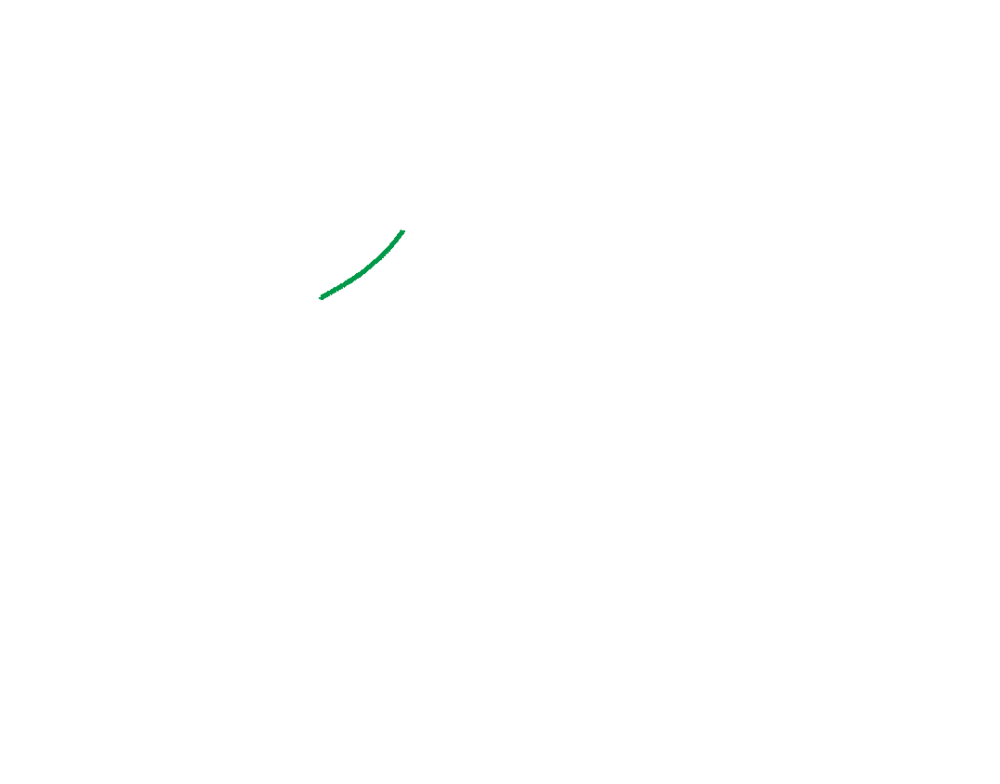
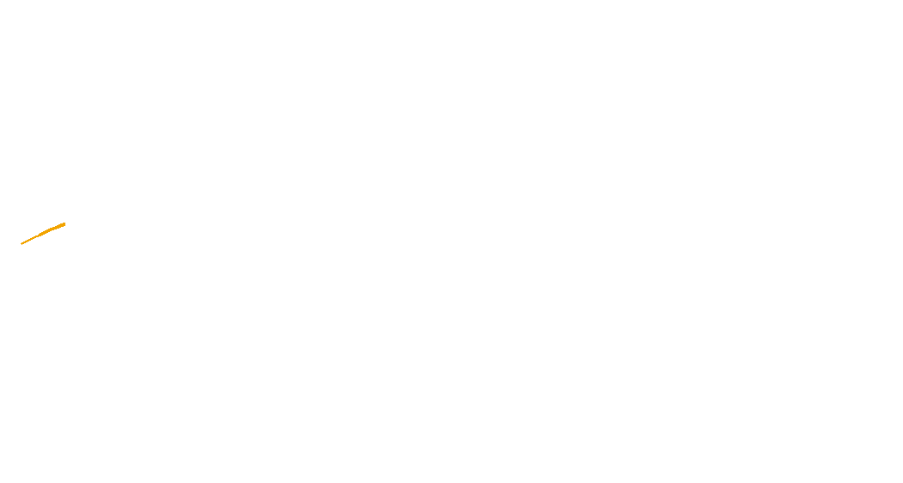

# Handwriting Animator

This Python script animates SVGs of handwriting, creating GIF animations that simulate the writing process.

Example animations from SVGs traced in Inkscape from public domain historical figure signatures ([Jean Lannes](https://en.wikipedia.org/wiki/Jean_Lannes) and [Jean-de-Dieu Soult](https://en.wikipedia.org/wiki/Jean-de-Dieu_Soult)):
<p align="center">
  
  
</p>

## Features

- Works best with unidirectional paths, such as those created by tracing handwriting in programs like Inkscape
- Compatible with files generated from [Calligrapher.ai](https://www.calligrapher.ai/) (use the lowest Stroke Width setting)

## Prerequisites

- Python 3.7 or later

## Installation

1. Clone the repository or download the ZIP file:
   ```
   git clone https://github.com/cadaeix/HandwritingAnimator.git
   ```
   Or download and extract the ZIP file from the [GitHub repository](https://github.com/cadaeix/HandwritingAnimator).

2. Navigate to the project directory:
   ```
   cd HandwritingAnimator
   ```

3. Install the required dependencies:
   ```
   pip install -r requirements.txt
   ```

## Usage

1. Place your SVG file in the project directory.

2. Run the CLI tool:
   ```
   python svg_to_gif.py
   ```

3. Follow the prompts to configure your animation settings.

4. The script will generate a GIF animation based on your SVG file and chosen settings.

## Alternative Usage

If you prefer more control over the animation process, you can use `script.py` instead. This script provides direct access to the animation functions without the CLI interface.

## Tips for Best Results

- Use SVGs with unidirectional paths for the smoothest animations.
- When using Calligrapher.ai, set the Stroke Width to the lowest setting for optimal results. However, handwriting generated by Calligrapher.ai will loop back on itself, resulting in a "doublewriting" effect which may appear to be a pause after each word.

## Acknowledgements

This project was developed in collaboration with Claude.ai.

## License

[CC0](https://github.com/cadaeix/HandwritingAnimator/blob/main/LICENSE)

## Contributing

Feel free to submit a pull request or something

## Todo?
- Attach this to something inspired by [this](https://github.com/sjvasquez/handwriting-synthesis) so that you can generate both the handwriting and the animation in one step???
